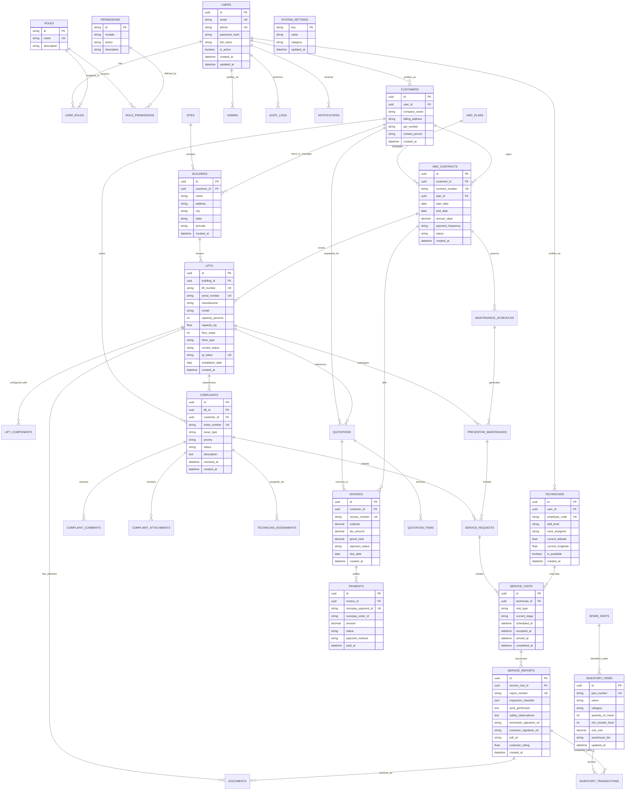

# WEPSUN Engineering Solutions
## Database Architecture & Entity-Relationship (ER) Specification
### Relational Schema Design for PostgreSQL 16 (Prisma ORM)

---

## 1. Database Entity-Relationship (ER) Diagram

---

## 2. Key Architectural Constraints & Optimizations

1. **Multi-Tenancy & Scoping**:
   - Every operational entity (`LIFTS`, `BUILDINGS`, `COMPLAINTS`, `INVENTORY`, `INVOICES`) belongs directly to a company/tenant ID with PostgreSQL row-level indexing.
2. **High-Performance Query Indexing**:
   - Composite index on `COMPLAINTS(lift_id, status, priority)`.
   - Index on `TECHNICIANS(is_available, zone_assigned)`.
   - Index on `PREVENTIVE_MAINTENANCE(next_due_date, status)`.
   - Unique constraints on `LIFTS.qr_token`, `COMPLAINTS.ticket_number`, `INVOICES.invoice_number`.
3. **Audit & Soft Deletion**:
   - All core tables feature `deleted_at TIMESTAMP NULL` for regulatory compliance in elevator safety inspections.
   - Any state change triggers an asynchronous audit event into `AUDIT_LOGS`.
