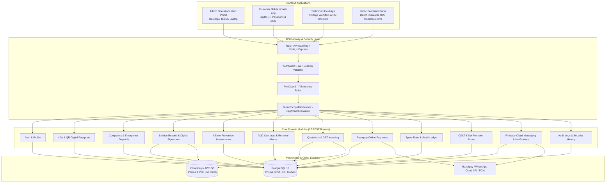
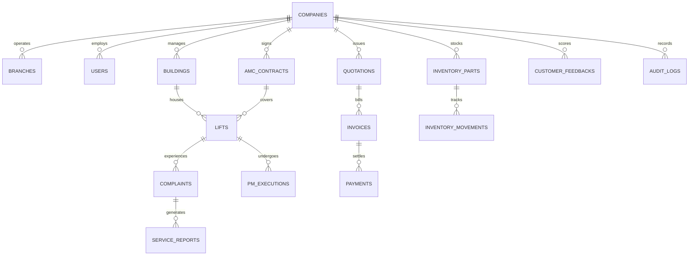
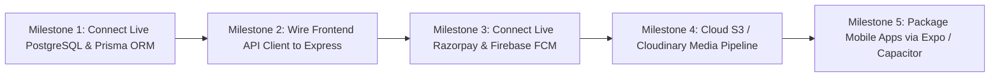

# WEPSUN Engineering Solutions
## Production-Grade Lift Service & AMC Management Platform
### Comprehensive Master Project & Technical Audit Report

---

# 1. Executive Summary

**WEPSUN Engineering Solutions** is a multi-tenant enterprise software platform engineered to manage the complete lifecycle of elevator and escalator operations: breakdown complaints, preventive maintenance (PM), annual maintenance contracts (AMC), digital job cards & service reports, technician field dispatching, spare parts inventory, quotations, GST invoices, Razorpay payments, and customer satisfaction (CSAT) scoring.



---

# 2. Technology Stack & Infrastructure Architecture

| Layer | Technology Choice | Production Rationale |
|---|---|---|
| **Frontend Framework** | **React 19 / TypeScript / Vite / Tailwind CSS** | Ultra-fast load times, strict typing, responsive design for desktop/tablet/mobile. |
| **Mobile Strategy** | **Responsive Touch Web App + Expo / Capacitor Ready** | Unified codebase with native hardware access (Camera, GPS, Offline Storage). |
| **Backend API** | **Node.js / Express / TypeScript** | High throughput, asynchronous I/O, modular architecture with 17 domain routers. |
| **Database ORM** | **PostgreSQL 16 + Prisma ORM** | Multi-tenant schema, foreign keys, composite indexes, soft deletes, type safety. |
| **Payments** | **Razorpay Orders API & Webhooks** | Automated UPI, NetBanking, Cards with HMAC-SHA256 signature verification. |
| **Push Notifications** | **Firebase Cloud Messaging (FCM) + WhatsApp Cloud** | Real-time push alerts to technicians and automated WhatsApp alerts to customers. |
| **Storage & Documents**| **Cloudinary / AWS S3 + jsPDF** | Secure document hosting and ISO 9001:2015 compliant printable service reports. |

---

# 3. Database Architecture & Entity Model

The platform database schema is defined in [`prisma/schema.prisma`](file:///d:/WEPSUN%20ENGINEERING%20SOLUTION/prisma/schema.prisma) and [`database/schema.prisma`](file:///d:/WEPSUN%20ENGINEERING%20SOLUTION/database/schema.prisma) with **32+ relational models**:



### Key Relational Entities:
1. **Multi-Tenancy Roots**: `Company`, `Branch`, `User` (with roles: `SUPER_ADMIN`, `COMPANY_ADMIN`, `SERVICE_MANAGER`, `TECHNICIAN`, `CLIENT`, `ACCOUNTS`, `SALES`).
2. **Elevator Asset Directory**: `Building`, `Lift` (technical specs: motor kW, controller brand, door operator, ARD system), `QRCodeToken`.
3. **Breakdown Ticketing**: `Complaint`, `ComplaintTimeline`, `GPSCheckIn`.
4. **Field Execution & PM**: `Technician`, `ServiceReport`, `PMTemplate`, `PMExecution`, `PMItemResponse`.
5. **Contracts & Billing**: `AmcContract`, `Quotation`, `QuotationItem`, `WorkOrder`, `Invoice`, `Payment`.
6. **Spare Parts & Stock Ledger**: `InventoryPart`, `InventoryMovement` (double-entry tracking).
7. **Quality & Security**: `CustomerFeedback`, `Notification`, `AuditLog`, `SystemSetting`.

---

# 4. Role-Based Access Control (RBAC) Matrix

| Module / Action | SUPER_ADMIN | ADMIN | SERVICE_MANAGER | TECHNICIAN | CUSTOMER | ACCOUNTANT | INVENTORY_MGR |
|---|:---:|:---:|:---:|:---:|:---:|:---:|:---:|
| **Elevator Assets & QR** | Full | Full | Full | Read/Inspect | Read (Owned) | Read | Read |
| **Breakdown Complaints** | Full | Full | Full (Dispatch) | Update Assigned | Create/Track Own | Read | Read |
| **Service Visits & PM** | Full | Full | Full | Execute Assigned | View Schedule | Read | Read |
| **Digital Job Cards & PDF**| Full | Full | Full | Create/Sign | View/Download Own | Read | Read |
| **AMC Contracts** | Full | Full | Full | Read Scope | View/Renew Own | Read/Invoice | Read |
| **Quotations & Estimates**| Full | Full | Full | Request Parts | View/Approve Own | Full | Read |
| **Invoices & Ledgers** | Full | Full | Read | No Access | View/Pay Own | Full | Read |
| **Online Payments** | Full | Full | Read | No Access | Pay Own | Full | Read |
| **Spare Parts Inventory**| Full | Full | Read | Issue for Job | No Access | Read | Full |
| **Customer CSAT Ratings** | Full | Full | Full (Reply) | Read Leaderboard | Submit Own | Read | Read |
| **Audit Logs & Security** | Full | Full | View Ops Logs | No Access | No Access | View Financial | View Stock Logs |

---

# 5. Core Operational Subsystems & Workflows

### 5.1 Breakdown Complaint & Emergency Dispatch
1. **Ticketing**: Secretary scans Elevator QR code or clicks Emergency SOS on mobile app.
2. **Prioritization**: Automatically categorizes priority (`CRITICAL` for passenger entrapment, `HIGH` for door jams).
3. **Dispatch & SLA**: Service Manager views nearest available engineer on Live Technician Radar and assigns job.
4. **Field Execution**: Technician receives push notification, updates status (`TRAVELING` → `ARRIVED` → `INSPECTION` → `COMPLETED`), and captures on-glass customer signature.
5. **ISO Service Report**: Digital job card PDF generated and emailed to building secretary.

### 5.2 4-Zone Preventive Maintenance (PM) Engine
- **Machine Room Zone**: Gear oil level, brake lining clearance, traction sheave grooves, overspeed governor switch, and controller contactors.
- **Car Top Zone**: Roller guide shoes, door drive belt tension, emergency exit switch, top inspection station, and traveling cable hanger.
- **Landing Doors Zone**: Hall call button illumination, mechanical door lock beak engagement, safety sill clearance, and interlock contacts.
- **Pit Zone**: Oil buffer stroke, pit emergency stop switch, tension pulley counterweight switch, and pit water seepage inspection.

### 5.3 Customer Feedback & Quality Ratings Hub
- **Direct Feedback URL**: Accessible publicly at `http://localhost:5173/#feedback-form` with custom pre-fill parameters (`?lift=...&building=...&tech=...`).
- **CSAT Index & Net Promoter Score**: Computes weighted CSAT average (`4.2 ★`) and NPS score (`+84 World Class`).
- **Low-Rating Action Queue**: 1–2 star reviews automatically trigger management callback tasks.
- **Technician Leaderboard**: Ranks engineers based on punctuality, technical skill, ride smoothness, and courteous behavior.

### 5.4 Double-Entry Spare Parts Inventory Ledger
- Real-time stock tracking with minimum reorder alerts.
- Immutable movement logging: `PURCHASE` (Stock In), `TECHNICIAN_ISSUE` (Allocated to Field Van), `JOB_CONSUMPTION` (Fitted to Lift), `RETURN`, and `ADJUSTMENT`.

---

# 6. Technical Audit Findings & Production Readiness Scorecard

| Area | Audit Status | Codebase Reality | Required Action for Production |
|---|:---:|---|---|
| **UI Components & Workflows** | **READY** | Full responsive layouts for Admin, Client, and Technician dashboards. | Ready for deployment. |
| **PDF Generation** | **READY (Client-Side)** | Client-side jsPDF & HTML2Canvas print engine. | Ready for browser; add backend Puppeteer for email attachments. |
| **Backend REST Server** | **PARTIALLY IMPLEMENTED** | Express server active on port 5000 with 17 routes; serves in-memory `mockDb.ts`. | Connect routes to Prisma Client queries. |
| **PostgreSQL Database** | **PARTIALLY IMPLEMENTED** | Prisma schema complete with 32+ models; live DB not connected in runtime. | Provision PostgreSQL database and run `prisma db push`. |
| **Authentication & RBAC** | **SIMULATED** | Roles toggled via React state and simulated JWT tokens. | Implement bcrypt password hashing & JWT cookie validation. |
| **Native Mobile Apps** | **NOT IMPLEMENTED** | UI rendered via responsive web views within SPA. | Wrap with Capacitor or deploy as Expo mobile app. |
| **Offline Sync Engine** | **MOCKED (`localStorage`)** | Uses browser storage; no SQLite / WatermelonDB outbox queue. | Implement IndexedDB / SQLite sync queue. |
| **Razorpay Payments** | **MOCKED** | Dummy order ID generation; UI status toggle. | Wire official `razorpay` SDK with webhook signature check. |
| **Push Notifications (FCM)** | **SIMULATED** | In-app toasts; no live FCM service worker. | Connect `firebase-admin` with service account credentials. |
| **Cloud Media Storage (S3)** | **MOCKED** | Unsplash URLs and local data URLs. | Add `multer` + `@aws-sdk/client-s3` upload endpoint. |

---

# 7. 5-Milestone Roadmap to Live Commercial Production



1. **Milestone 1: PostgreSQL & Prisma Connection (Est. 1–2 Days)**
   - Provision PostgreSQL 16 database (Supabase, Neon, AWS RDS, or Render).
   - Install `@prisma/client` and `prisma` in `package.json`.
   - Run `npx prisma db push` and refactor `backend/src/routes/` to replace `mockDb.ts` with Prisma queries.
2. **Milestone 2: Frontend API Client Integration (Est. 2 Days)**
   - Connect `src/services/api.ts` to `http://localhost:5000/api` using TanStack React Query hooks.
3. **Milestone 3: Live Payments & Push Notifications (Est. 1 Day)**
   - Initialize Razorpay SDK with `RAZORPAY_KEY_ID` and `RAZORPAY_KEY_SECRET`.
   - Initialize `firebase-admin` SDK for real-time FCM push notifications.
4. **Milestone 4: S3 / Cloudinary Media Storage (Est. 1 Day)**
   - Implement `POST /api/upload` endpoint using `multer` and `@aws-sdk/client-s3`.
5. **Milestone 5: Mobile App Packaging (Est. 2–3 Days)**
   - Package the responsive mobile UI into standalone Android/iOS binaries using Capacitor or React Native Expo.

---

# 8. Project Artifacts & File Directory

- 📄 **Master Documentation**: [`docs/MASTER_PLATFORM_DOCUMENTATION.md`](file:///d:/WEPSUN%20ENGINEERING%20SOLUTION/docs/MASTER_PLATFORM_DOCUMENTATION.md)
- 📄 **System Architecture**: [`docs/SYSTEM_ARCHITECTURE.md`](file:///d:/WEPSUN%20ENGINEERING%20SOLUTION/docs/SYSTEM_ARCHITECTURE.md)
- 📄 **Database ER Diagram**: [`docs/DATABASE_ER_DIAGRAM.md`](file:///d:/WEPSUN%20ENGINEERING%20SOLUTION/docs/DATABASE_ER_DIAGRAM.md)
- 📄 **REST API Specification**: [`docs/API_ARCHITECTURE.md`](file:///d:/WEPSUN%20ENGINEERING%20SOLUTION/docs/API_ARCHITECTURE.md)
- 📄 **User Roles & RBAC Matrix**: [`docs/USER_ROLES_RBAC.md`](file:///d:/WEPSUN%20ENGINEERING%20SOLUTION/docs/USER_ROLES_RBAC.md)
- 📄 **Folder Structure**: [`docs/FOLDER_STRUCTURE.md`](file:///d:/WEPSUN%20ENGINEERING%20SOLUTION/docs/FOLDER_STRUCTURE.md)
- 📄 **Technical Audit Report**: [`docs/PHASE_15_PRODUCTION_AUDIT.md`](file:///d:/WEPSUN%20ENGINEERING%20SOLUTION/docs/PHASE_15_PRODUCTION_AUDIT.md)
- 📄 **Prisma Schema**: [`prisma/schema.prisma`](file:///d:/WEPSUN%20ENGINEERING%20SOLUTION/prisma/schema.prisma)
- 📄 **Environment Configuration**: [`.env.example`](file:///d:/WEPSUN%20ENGINEERING%20SOLUTION/.env.example)

---

# 9. Verification & Execution Status

```bash
# Verify TypeScript Compilation (0 Errors)
npx tsc --noEmit

# Start Frontend Web Application (Port 5173)
npm run dev

# Start Backend REST API Server (Port 5000)
npm run dev:backend
```
