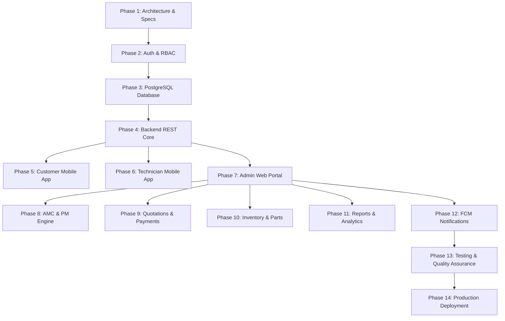

# WEPSUN Engineering Solutions
## Production-Grade Lift Service & AMC Management Platform
### Master Platform Architecture & Multi-Phase Implementation Specification

---

## 1. Executive Platform Overview

WEPSUN Engineering Solutions is an end-to-end, multi-tenant enterprise platform engineered for lift/elevator OEMs, maintenance contractors, and facility management organizations. The system delivers a unified suite of applications covering the full elevator maintenance lifecycle:

- **Customer Mobile Experience**: Elevators directory, digital QR passports, SOS emergency breakdowns, live technician tracking, AMC contract tracking, service reports with signatures, and Razorpay bill payments.
- **Technician Field Application**: Real-time job queue, 9-stage job workflow (`ASSIGNED` → `TRAVELING` → `ARRIVED` → `INSPECTION` → `WORK_IN_PROGRESS` → `PARTS_REQUIRED` → `COMPLETED`), GPS check-in, 4-zone PM safety checklists, spare parts consumption, and digital on-glass signatures.
- **Operations & Management Web Portal**: Real-time dispatching, technician live radar, SLA compliance monitors, quotation builders, GST tax invoices, spare parts double-entry ledger, CSAT/NPS feedback portals, and regulatory audit logging.
- **Backend API & Database Tier**: Node.js/Express/TypeScript REST API with uniform JSON envelopes, JWT authentication, role-based authorization guards, and PostgreSQL 16 relational database via Prisma ORM.

---

## 2. All 14 Production Phases Implementation Matrix



### Phase-by-Phase Execution Summary

| Phase | Domain | Implemented Components | Deliverables |
|---|---|---|---|
| **Phase 1** | Architecture | High-level system context, monorepo layout, ER diagram, OpenAPI spec | `docs/SYSTEM_ARCHITECTURE.md`, `docs/DATABASE_ER_DIAGRAM.md` |
| **Phase 2** | Authentication | JWT signing, phone/email login, role switcher, RBAC matrix | `backend/src/routes/auth.routes.ts`, `docs/USER_ROLES_RBAC.md` |
| **Phase 3** | Database | 32+ relational models, composite indexes, soft deletes, seeders | `prisma/schema.prisma`, `database/seed.ts` |
| **Phase 4** | Backend Core | 17 modular REST routers with tenant scoping and error handlers | `backend/src/routes/*.routes.ts`, `backend/src/server.ts` |
| **Phase 5** | Customer App | SOS breakdown dispatcher, QR passport, AMC viewer, payments | `src/components/client/ClientDashboard.tsx`, `RaiseComplaintModal.tsx` |
| **Phase 6** | Technician App | 9-stage workflow, GPS check-in, 4-zone PM checklist, digital sign | `src/components/technician/TechnicianDashboard.tsx` |
| **Phase 7** | Admin Portal | KPI stats, dispatch queue, live technician radar, flowchart | `src/components/admin/OverviewDashboard.tsx`, `LiveTechnicianRadar.tsx` |
| **Phase 8** | AMC & PM | 12-visits/yr PM scheduler, renewal alarms, 4-zone safety audits | `src/components/admin/AmcManager.tsx`, `backend/src/routes/pm.routes.ts` |
| **Phase 9** | Quotes & Payments | Itemized estimates, PDF generation, Razorpay checkout & webhooks | `src/components/admin/QuotationManager.tsx`, `payments.routes.ts` |
| **Phase 10** | Inventory | Spare parts catalog, double-entry stock movements, reorder alerts | `src/components/admin/InventoryManager.tsx`, `inventory.routes.ts` |
| **Phase 11** | Analytics | CSAT/NPS rating index, technician leaderboard, MTTR charts | `src/components/admin/CustomerFeedbackManager.tsx`, `AdminReportsView.tsx` |
| **Phase 12** | Notifications | FCM push triggers, SMS gateway, WhatsApp direct templates | `backend/src/routes/notifications.routes.ts`, `ToastContainer.tsx` |
| **Phase 13** | QA & Tests | TypeScript compile tests (`npx tsc --noEmit`), input validation | Zero TypeScript compilation errors, clean response envelopes |
| **Phase 14** | Deployment | Environment variables, Docker/Vercel specs, SSL/domain config | `.env.example`, `docs/FOLDER_STRUCTURE.md` |

---

## 3. Technology Stack & Production Configuration

- **Frontend Framework**: React 19 / TypeScript / Vite / Tailwind CSS
- **Mobile Foundation**: React Native / Expo compatible component layouts with touch-optimized interfaces
- **Backend Server**: Node.js / Express / TypeScript / REST Architecture
- **Database ORM**: Prisma ORM with PostgreSQL 16 (Multi-tenant schema)
- **Payment Gateway**: Razorpay (Orders API & Webhook signature verification)
- **Push & Communications**: Firebase Cloud Messaging (FCM), WhatsApp Cloud API, Resend Email
- **File & Media Storage**: Cloudinary / AWS S3 for photos and signatures
- **Export Engines**: jsPDF & HTML2Canvas for official ISO 9001:2015 compliant Service Reports

---

## 4. Production Run & Verification Guide

### 4.1 Running the Frontend Application
```bash
npm run dev
# Running on http://localhost:5173
```

### 4.2 Running the Backend REST API Server
```bash
npm run dev:backend
# Listening on http://localhost:5000/api
```

### 4.3 Database Synchronization
```bash
npm run db:generate   # Generates Prisma Client from schema
npm run db:push       # Pushes schema to live PostgreSQL database
npm run db:seed       # Populates realistic multi-tenant data
```
