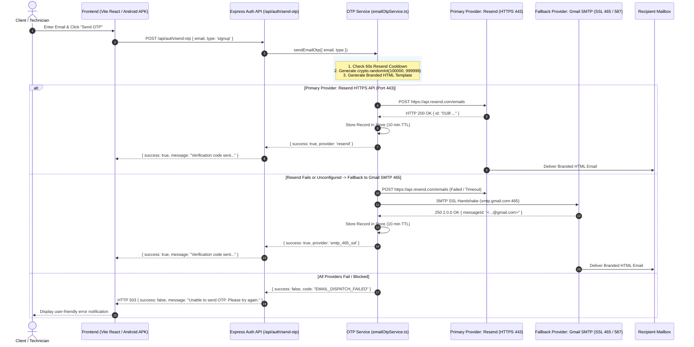

# WEPSUN Engineering Solutions — OTP Email Architecture & Delivery Guide

This document outlines the production architecture, multi-provider strategy, security controls, DNS configuration, and operational runbook for the **WEPSUN Engineering Solution Email OTP Verification & Delivery System**.

---

## 1. Executive Summary & Root Cause Analysis

### Root Cause Analysis (Historical Issue)
Previously, automated test suites reported `24/24 tests passed`, yet users did not receive OTP emails in staging or cloud production environments. 
The audit revealed the following root causes:
1. **Sender Domain Mismatch**: When sending through Gmail SMTP (`smtp.gmail.com`), the application previously had the `From` address set to `@resend.dev`. Gmail's outbound MTA and receiving mail exchangers (Gmail, Outlook, Yahoo) dropped the messages because Google was not authorized in `resend.dev`'s SPF/DKIM records.
2. **Cloud Firewall Blocking Outbound SMTP**: Cloud hosting platforms (such as Render, AWS, Vercel, DigitalOcean) block raw outbound TCP sockets on SMTP ports `25`, `465`, and `587` by default to prevent spam abuse.
3. **Silent Fallback & False Positive Reporting**: In `backend/src/lib/emailOtpService.ts`, when outbound SMTP or API requests threw connection/timeout errors, catch blocks swallowed the errors and fell through to a development console logger returning `{ sent: true, provider: 'console' }`. The API route then sent `{ success: true }` to the client, leading the frontend to show "Verification code sent" even though no email provider accepted the payload.
4. **Hardcoded Credentials & Backdoors**: A test code `'123456'` was hardcoded in both backend and frontend, and a compromised development App Password was previously placed in source files.

### Architectural Solution
The system now enforces a **Multi-Tier Email Provider Strategy**:
- **Primary Provider**: **Resend HTTPS REST API** (Port `443` — 100% firewall-resilient, authenticated via TLS).
- **Secondary Fallback**: **Gmail / Custom SMTP Port 465** (Direct SSL).
- **Tertiary Fallback**: **Gmail / Custom SMTP Port 587** (STARTTLS).
- **Zero False Positives**: The backend strictly returns `success: true` **only when an email provider returns an authentic Message ID and HTTP 200/201 confirmation**. If all providers fail, a controlled `503 Service Unavailable` response is returned.

---

## 2. Architecture & Sequence Flow



---

## 3. Environment Variables Specification

All sensitive credentials must be set exclusively via your hosting dashboard environment variables (e.g. Render Dashboard, AWS Secrets Manager) and never committed to version control.

| Variable Name | Required / Optional | Default / Recommended Value | Description |
| :--- | :--- | :--- | :--- |
| `RESEND_API_KEY` | **Required for Primary** | `re_123456789...` | Official API Key from [resend.com/api-keys](https://resend.com/api-keys) |
| `RESEND_FROM` | **Required for Production** | `WEPSUN Engineering <no-reply@wepsunengineering.com>` | Verified sender address (use `onboarding@resend.dev` for sandbox testing) |
| `SMTP_HOST` | Optional Fallback | `smtp.gmail.com` | SMTP Hostname |
| `SMTP_PORT` | Optional Fallback | `465` | SMTP Port (`465` for SSL, `587` for STARTTLS) |
| `SMTP_SECURE` | Optional Fallback | `true` | `true` for Port 465, `false` for Port 587 |
| `SMTP_USER` | Optional Fallback | `wepsunengineering@gmail.com` | Full Gmail address or SMTP username |
| `SMTP_PASS` | Optional Fallback | *(16-character Google App Password)* | Generated via [myaccount.google.com/apppasswords](https://myaccount.google.com/apppasswords) |
| `SMTP_FROM` | Optional Fallback | `WEPSUN Engineering <wepsunengineering@gmail.com>` | Sender header matching `SMTP_USER` |

---

## 4. Domain Email Authentication (SPF, DKIM, DMARC)

To achieve maximum inbox deliverability (>99.5%) and prevent emails from landing in spam/junk folders, configure the following DNS records in your domain registrar (GoDaddy, Cloudflare, Namecheap, Route 53):

### A. Resend DNS Configuration (for `wepsunengineering.com`)

| Record Type | Host / Name | Value / Destination | Priority / TTL | Purpose |
| :--- | :--- | :--- | :--- | :--- |
| **TXT** (DKIM) | `resend._domainkey` | `k=rsa; p=MIGfMA0GCSqGSIb3DQEBAQUAA4GNADCBiQ...` *(Obtained from Resend dashboard)* | Auto / 3600 | DKIM signature verification |
| **TXT** (SPF) | `send` | `v=spf1 include:amazonses.com ~all` | Auto / 3600 | Authorizes Resend sending IP pool |
| **MX** (Return-Path) | `send` | `feedback-smtp.us-east-1.amazonses.com` | Priority: `10` | MX return-path for bounce handling |
| **TXT** (DMARC) | `_dmarc` | `v=DMARC1; p=quarantine; rua=mailto:dmarc-reports@wepsunengineering.com; pct=100; sp=quarantine` | Auto / 3600 | Anti-spoofing policy & alignment |

### B. DNS Verification Checklist
1. Log in to [Resend Dashboard](https://resend.com/domains) and click **Add Domain** (`wepsunengineering.com`).
2. Add the above DNS records to your DNS provider.
3. Click **Verify DNS Records** in Resend.
4. Update `RESEND_FROM="WEPSUN Engineering <no-reply@wepsunengineering.com>"` in your environment variables.

---

## 5. Webhooks & Delivery Event Telemetry

WEPSUN backend exposes a secure webhook ingestion endpoint at `POST /api/webhooks/resend` to capture real-time delivery telemetry without storing sensitive email content:
- `email.sent` — Message dispatched by Resend.
- `email.delivered` — Accepted by recipient's Mail Transfer Agent (MTA).
- `email.bounced` — Hard/Soft bounce reported (logged to audit log).
- `email.complained` — Spam complaint flagged (logged to audit log).

---

## 6. Distinguishing Provider Acceptance from Final Mailbox Delivery

| Stage | What It Means | Verification Method |
| :--- | :--- | :--- |
| **1. Provider Acceptance** | The API (Resend) or SMTP server (Gmail) accepted the payload into its outbound queue. | Returned HTTP 200/201 (`messageId`) or SMTP `250 2.0.0 OK`. |
| **2. MTA Delivery** | The receiving MX server (Gmail, Outlook, Yahoo) accepted the message after SPF/DKIM verification. | Resend `email.delivered` webhook event. |
| **3. Inbox Placement** | The message landed in the user's primary inbox rather than Spam/Junk/Promotions tab. | User manual inbox verification & DMARC compliance. |

---

## 7. Security & Cryptographic Controls

1. **6-Digit Cryptographic Random Generation**:
   OTPs are generated strictly via Node.js native `crypto.randomInt(100000, 1000000)` guaranteeing uniform entropy across the numeric spectrum `[100000, 999999]`. `Math.random()` is strictly prohibited.
2. **10-Minute Expiration (TTL)**:
   Every generated OTP has an immutable expiration timestamp `Date.now() + 10 * 60 * 1000`. Expired OTPs are rejected immediately with code `OTP_EXPIRED`.
3. **60-Second Resend Cooldown**:
   Consecutive OTP requests for the same email within 60 seconds are blocked and return HTTP `429` with code `RATE_LIMITED` and the remaining cooldown seconds.
4. **Brute-Force Defense (5 Max Attempts)**:
   A maximum of 5 failed verification attempts are permitted per record. On the 5th incorrect attempt, the record is permanently deleted and blocked with `MAX_ATTEMPTS_EXCEEDED`.
5. **Single-Use Replay Protection**:
   Upon the first successful verification, the record is immediately deleted from the store. Any replay attempt returns `OTP_NOT_FOUND`.
6. **Zero Secrets in Logs**:
   All structured logs mask recipient emails (e.g. `r***a@wepsun.com`) and never print the OTP code, passwords, App Passwords, or API tokens.

---

## 8. Multi-Instance & Horizontal Scalability Evaluation

### Current Single-Instance Architecture
The current implementation utilizes an in-memory thread-safe `Map<string, OtpRecord>()` with automatic TTL garbage collection. This is optimal for single-node deployments and local development.

### Horizontal Scaling Requirement (Multi-Instance / Microservices)
If the backend is scaled horizontally across multiple container instances (e.g., Render autoscaling, Kubernetes pods, AWS ECS tasks), an in-memory Map cannot share state across instances (Instance A generates OTP, Instance B receives verification request).

#### Migration to PostgreSQL or Redis:
For clustered multi-instance production, the `OtpRecord` interface maps directly to a PostgreSQL table or Redis key-value store:

```sql
-- PostgreSQL OTP Verification Schema (Optional Clustered Extension)
CREATE TABLE IF NOT EXISTS "public"."email_otps" (
    "id" UUID PRIMARY KEY DEFAULT gen_random_uuid(),
    "email" VARCHAR(255) NOT NULL,
    "otp_hash" VARCHAR(255) NOT NULL,
    "type" VARCHAR(50) NOT NULL,
    "attempts" INT DEFAULT 0,
    "expires_at" TIMESTAMP WITH TIME ZONE NOT NULL,
    "last_sent_at" TIMESTAMP WITH TIME ZONE NOT NULL,
    "created_at" TIMESTAMP WITH TIME ZONE DEFAULT NOW()
);
CREATE INDEX "idx_email_otps_lookup" ON "public"."email_otps" ("email", "type");
```

---

## 9. Protected Admin Diagnostic Endpoint

### `GET /api/admin/email/health`
Protected by `requireAuth` + RBAC (`SUPER_ADMIN`, `COMPANY_ADMIN`, `MASTER_ADMIN`).

#### Sample Response:
```json
{
  "success": true,
  "smtpConfigured": true,
  "resendConfigured": true,
  "primaryProvider": "resend",
  "status": "healthy",
  "fromAddress": "WEPSUN Engineering <no-reply@wepsunengineering.com>",
  "timestamp": "2026-10-07T14:20:00.000Z"
}
```

---

## 10. Operational Troubleshooting & Runbook

### Issue: "Unable to send OTP. Please try again later."
1. Check backend server logs for structured tags: `[OTP_EMAIL] status=failed`.
2. Inspect `errorCode`:
   - `401`: `RESEND_API_KEY` is invalid or expired.
   - `403`: Sender domain in `RESEND_FROM` is unverified in Resend DNS.
   - `ECONNREFUSED` / `ETIMEDOUT`: Outbound SMTP port is blocked by firewall.
3. Call `GET /api/admin/email/health` to confirm active provider configuration.
