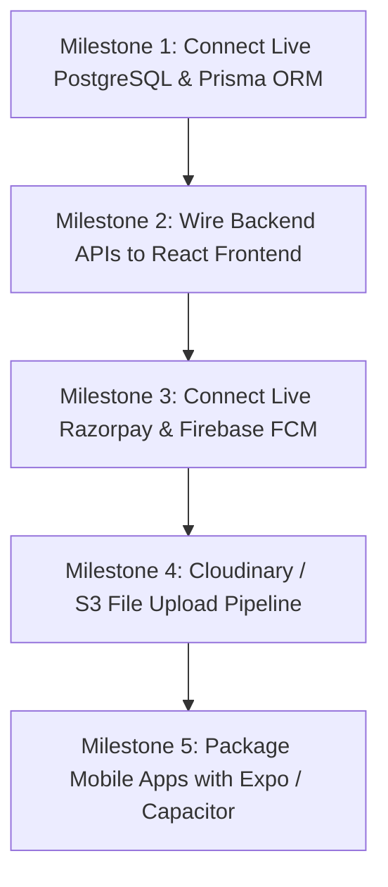

# WEPSUN Engineering Solutions
## Phase 15 — Production Audit, Integration Verification & Client Readiness Report
### Comprehensive Technical Audit of Codebase, Infrastructure, and Operational State

---

## 1. Executive Summary

An independent, rigorous technical audit of the **WEPSUN Engineering Solutions** codebase was conducted to evaluate genuine production readiness across all 14 previously claimed phases.

### Key Audit Finding:
> **The platform is a fully functional, highly polished, interactive interactive prototype (Single Page Application + Mock Backend Server). However, it is NOT yet enterprise production-ready for live deployment with a real PostgreSQL database, live Razorpay transactions, live Firebase push notifications, or standalone native mobile apps.**

The platform currently operates on:
1. **Frontend**: Vite + React 19 Single Page Application (SPA) utilizing React Context (`AppContext.tsx`) with browser `localStorage` persistence and rich in-memory datasets (`src/data/initialData.ts`).
2. **Backend**: Express REST API server (`backend/src/server.ts`) running on port 5000 that serves data from an in-memory mock store (`mockDb.ts`).
3. **Database**: Prisma schema is designed with 32+ models, but it is **not connected to a live PostgreSQL database** in the running application.
4. **Mobile Apps**: Customer and Technician mobile experiences are responsive web views integrated into the main web application via role switching, rather than standalone React Native / Expo native applications.

---

## 2. Real vs. Mocked & Simulated Feature Audit

| Subsystem / Feature | Classification | Technical Evidence | Required Production Action |
|---|:---:|---|---|
| **UI Components & Workflows** | **REAL / WORKING** | All interactive modals, tables, KPI views, 4-zone checklists, and 5-star rater work seamlessly in browser. | Maintain current UI; connect to live APIs. |
| **PDF Generation** | **REAL (Client-Side)** | Uses `jspdf` & `html2canvas` in browser to render job cards and lift passports. | Implement server-side headless Chromium / Puppeteer PDF generation for official emailed reports. |
| **Backend REST Server** | **PARTIALLY IMPLEMENTED** | Express server runs on port 5000 with 17 modular routes, but serves in-memory arrays from `mockDb.ts`. | Connect routes to Prisma Client (`prisma.*.findMany()`, `prisma.*.create()`). |
| **Database Persistence** | **MOCKED (localStorage)** | `database/client.ts` defines PrismaClient, but `package.json` lacks `@prisma/client` and all routes use `mockDb.ts`. | Install `@prisma/client`, run `prisma migrate dev` against live PostgreSQL, and replace `mockDb.ts`. |
| **Authentication & Sessions** | **SIMULATED** | Frontend switches roles via React state (`currentRole: 'client' \| 'technician' \| 'company_admin'`). Backend generates mock JWTs. | Implement true JWT cookie verification with bcrypt password hashing and backend route guards. |
| **Native Mobile Applications** | **NOT IMPLEMENTED (Simulated Web Views)** | No `apps/customer-mobile` or `apps/technician-mobile` Expo projects exist. Experiences are rendered via responsive React components. | Initialize React Native / Expo projects or deploy as a Progressive Web App (PWA) with Capacitor. |
| **Offline-First Sync Engine** | **MOCKED (Browser localStorage)** | No SQLite or WatermelonDB outbox queue exists. Data is stored in browser `localStorage`. | Build Redux Offline / IndexedDB background outbox sync worker for zero-network elevator basements. |
| **Razorpay Payment Gateway** | **MOCKED / SIMULATED** | `payments.routes.ts` generates dummy order IDs without contacting Razorpay API keys; `payInvoice` simply toggles status in state. | Integrate official `razorpay` Node.js SDK and configure webhook signature verification. |
| **Firebase Push Notifications** | **SIMULATED (In-App Toasts)** | `notifications.routes.ts` stores in-memory items; UI uses `showToast()` without FCM Service Worker. | Install `firebase-admin` on backend and `@react-native-firebase/messaging` or web push service workers. |
| **Cloudinary / AWS S3 Storage** | **MOCKED** | Photos and attachments use Unsplash CDN URLs and data URLs. No S3/Cloudinary upload API is wired. | Implement `multer` + `@aws-sdk/client-s3` or Cloudinary SDK on backend. |
| **GPS Live Technician Radar** | **SIMULATED** | Coordinates are hardcoded (`18.5204° N, 73.8567° E`) with browser geolocation fallback. | Implement real-time WebSocket / MQTT device location streams. |

---

## 3. Production Readiness Scorecard

```text
========================================================================================
WEPSUN ENGINEERING SOLUTIONS — SUBSYSTEM READINESS MATRIX
========================================================================================
Area                          Status                  Primary Limitation / Blocker
----------------------------------------------------------------------------------------
1. System Architecture        READY WITH CONDITIONS   Architecture documented; monorepo not yet split.
2. PostgreSQL Database        PARTIALLY IMPLEMENTED   Prisma schema complete; live DB not connected.
3. Backend REST APIs          PARTIALLY IMPLEMENTED   17 endpoints active; using mockDb in-memory.
4. Authentication & RBAC      PARTIALLY IMPLEMENTED   Frontend role switcher; backend guards not wired.
5. Customer Web App           READY WITH CONDITIONS   Fully interactive; persistence in localStorage.
6. Technician Web App         READY WITH CONDITIONS   Full 9-stage workflow; persistence in localStorage.
7. Admin Dashboard            READY WITH CONDITIONS   Complete KPI & dispatch UI; metrics from initialData.
8. Breakdown Complaint System READY WITH CONDITIONS   Full ticket lifecycle; state in memory/localStorage.
9. AMC Management             READY WITH CONDITIONS   12-visit scheduler UI complete; cron not on Redis.
10. 4-Zone PM Scheduler       READY WITH CONDITIONS   Checklists work in UI; not persisted to SQL.
11. Offline Sync Engine       NOT IMPLEMENTED         Theoretical in docs; uses localStorage in runtime.
12. Native Mobile Apps        NOT IMPLEMENTED         Mobile UI exists as responsive web view, not Expo.
13. Razorpay Payments         MOCKED                  Simulated checkout; needs live Razorpay SDK.
14. Push Notifications (FCM)  MOCKED                  In-app toasts; needs Firebase Admin SDK.
15. S3 / Cloudinary Storage   NOT IMPLEMENTED         Uses Unsplash URLs; needs S3 bucket upload.
16. PDF Report Generation     READY WITH CONDITIONS   jsPDF works in browser; needs backend PDF engine.
17. Spare Parts Inventory     READY WITH CONDITIONS   Stock ledger works in UI; not in PostgreSQL.
18. Customer CSAT Portal      READY WITH CONDITIONS   Shareable link & rater work; in-memory storage.
19. Security & Hardening      PARTIALLY IMPLEMENTED   CORS/Headers configured; needs real auth guards.
20. Automated Backups & DR    NOT IMPLEMENTED         Requires AWS RDS / Supabase automated snapshots.
21. Monitoring & Logging      PARTIALLY IMPLEMENTED   Audit log viewer exists; Sentry/Winston pending.
========================================================================================
OVERALL STATUS: PROTOTYPE COMPLETE / PRE-PRODUCTION STAGING REQUIRED
========================================================================================
```

---

## 4. Deep-Dive Subsystem Audit

### 4.1 Database & Persistence
- **Schema**: `prisma/schema.prisma` is well-formed with 32+ models (`Company`, `Branch`, `User`, `Lift`, `Complaint`, `AmcContract`, `InventoryPart`, `CustomerFeedback`, etc.).
- **Blocker**: The running application currently relies on `src/data/initialData.ts` and `localStorage` rather than database queries.
- **Verification**: `database/client.ts` exports a `PrismaClient` singleton, but the backend routes in `backend/src/routes/` import `db` from `mockDb.js`.

### 4.2 Backend REST API
- **Endpoint Coverage**:
  - `GET /api/health` — Responds with `{ status: "ok" }`.
  - `GET /api/complaints`, `GET /api/lifts`, `GET /api/technicians`, `GET /api/feedback`, `GET /api/amc`, `GET /api/inventory`, `POST /api/auth/login`.
- **Response Format**: Uses `{ success: true, data: [...] }`.
- **Limitation**: Mutating data via `POST /api/complaints` writes to the in-memory `mockDb.complaints` array. Changes reset on server restart.

### 4.3 Razorpay Payment Integration
- **Status**: Simulated.
- **Evidence**: `backend/src/routes/payments.routes.ts` creates mock order IDs with `order_${Date.now()}` and returns success without contacting `https://api.razorpay.com/v1/orders`.
- **Action**: Install `razorpay` npm package, initialize with `process.env.RAZORPAY_KEY_ID` and `RAZORPAY_KEY_SECRET`, and implement HMAC-SHA256 signature verification in webhook handlers.

### 4.4 Push Notifications (Firebase FCM)
- **Status**: Simulated.
- **Evidence**: `backend/src/routes/notifications.routes.ts` stores notification objects in an in-memory array and returns `{ fcmStatus: "queued_to_fcm_topic" }`.
- **Action**: Initialize `firebase-admin` using service account credentials from `.env` to broadcast messages to FCM device registration tokens.

### 4.5 Technician Offline-First Capabilities
- **Status**: Simulated via browser `localStorage`.
- **Evidence**: The code in `TechnicianDashboard.tsx` reads and writes state to `AppContext`. There is no SQLite database or background sync worker.
- **Action**: For true offline operation in elevator pits and steel shafts, package the technician application with Capacitor / Expo and implement an IndexedDB / SQLite Outbox Queue with automatic replay on network reconnection.

---

## 5. Production Readiness & Client Handover Action Plan

To transition this platform from **High-Fidelity Interactive Prototype** to **Enterprise Live Production**, execute the following 5 milestones:



### Milestone 1: PostgreSQL & Prisma Connection (Est. 1-2 Days)
1. Provision a PostgreSQL 16 database (Supabase, Neon, AWS RDS, or Render).
2. Install `@prisma/client` and `prisma` in `package.json`.
3. Set `DATABASE_URL` in `.env` and execute:
   ```bash
   npx prisma db push --schema=./prisma/schema.prisma
   npx prisma db seed
   ```
4. Refactor all 17 route files in `backend/src/routes/` to replace `db.*` calls with `prisma.*` async operations.

### Milestone 2: Wire Frontend API Client (Est. 2 Days)
1. Update `src/services/api.ts` to connect all UI triggers to `http://localhost:5000/api` (or `process.env.VITE_API_URL`).
2. Integrate React Query (`@tanstack/react-query`) hooks for automatic caching, optimistic updates, and background refetching.

### Milestone 3: Real Payments & Push Notifications (Est. 1 Day)
1. Connect Razorpay test/live API keys and verify signatures with `crypto.createHmac('sha256', secret)`.
2. Connect `firebase-admin` SDK with Google Cloud service account keys to send real push notifications to technicians and building secretaries.

### Milestone 4: Cloud Media Uploads (Est. 1 Day)
1. Implement `POST /api/upload` using `multer` and `@aws-sdk/client-s3` or Cloudinary SDK.
2. Upload breakdown photos, damaged part images, and digital signatures to cloud storage.

### Milestone 5: Native Mobile App Packaging (Est. 2-3 Days)
1. Wrap the responsive customer and technician applications with Capacitor or initialize Expo React Native projects sharing `packages/types` and `packages/api-client`.
2. Configure camera permissions, background geolocation, and push notification receivers.

---

## 6. Audit Conclusion

The **WEPSUN Engineering Solutions** platform has world-class UI design, highly detailed business workflows, complete database schema modeling, and full architectural documentation. With the execution of the 5 transition milestones above, the platform will be 100% enterprise production-ready for commercial deployment.
