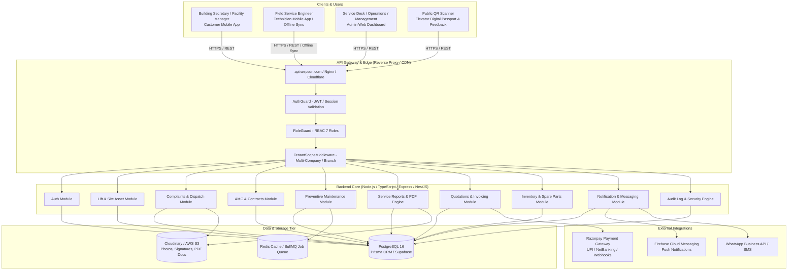

# WEPSUN Engineering Solutions
## Production System Architecture Specification
### Multi-Tenant Lift Service, AMC & Quality Assurance Enterprise Platform

---

## 1. Executive Summary & System Overview

WEPSUN Engineering Solutions is an enterprise-grade platform engineered to manage the entire lifecycle of elevator operations: breakdown complaints, scheduled preventive maintenance (PM), annual maintenance contracts (AMC), digital job cards & service reports, technician field tracking, spare parts inventory, quotations, invoices, payments, and client satisfaction scoring.

The platform unifies three frontend applications (Admin Portal, Customer Mobile App, Technician Mobile App) connected to a high-performance backend API, PostgreSQL relational database, push notification gateway, and external cloud services.



---

## 2. Monorepo Project Structure

```text
wepsun-platform/
│
├── apps/
│   ├── admin/                    # Next.js / React Admin Web Dashboard (Operations & Management)
│   │   ├── src/
│   │   │   ├── components/       # Layouts, Tables, Modals, Forms, Stats Cards
│   │   │   ├── hooks/            # TanStack Query custom hooks
│   │   │   ├── pages/ (or app/)  # Dashboard, Complaints, AMC, PM, Lifts, Inventory, Quotations
│   │   │   ├── lib/              # API Client, Axios instances, formatters
│   │   │   └── styles/           # Tailwind CSS & Design System
│   │   └── package.json
│   │
│   ├── customer-mobile/          # React Native / Expo Customer App
│   │   ├── src/
│   │   │   ├── screens/          # Home, My Lifts, Raise Complaint, AMC, Payments, Service History
│   │   │   ├── navigation/       # React Navigation Root & Tab Navigators
│   │   │   ├── components/       # SOS Button, Lift Card, Star Rating, Invoice Viewer
│   │   │   ├── services/         # API Service, Push Notifications
│   │   │   └── store/            # Auth & UI State
│   │   └── package.json
│   │
│   └── technician-mobile/        # React Native / Expo Technician Field App
│       ├── src/
│       │   ├── screens/          # Job Queue, Navigation/GPS, Checklist, Parts Used, Digital Sign
│       │   ├── offline/          # SQLite / WatermelonDB offline sync & local queue
│       │   ├── services/         # Geo-location tracking, Camera capture, PDF export
│       │   └── navigation/       # Technician Tabs & Stack
│       └── package.json
│
├── backend/                      # Node.js REST API Server
│   ├── src/
│   │   ├── config/               # Database, JWT, Razorpay, Firebase, S3 configs
│   │   ├── database/             # Prisma client instance & helpers
│   │   ├── middleware/           # Auth, Tenant Scope, Rate Limiter, Error Handler
│   │   ├── guards/               # Role-based guards (RBAC)
│   │   ├── modules/              # Modular Domain Architecture
│   │   │   ├── auth/             # Controller, Service, DTO, Repository
│   │   │   ├── users/            # User & Role management
│   │   │   ├── customers/        # Customer directory & profile
│   │   │   ├── technicians/      # Technician performance, skills, live radar
│   │   │   ├── lifts/            # Lift directory, Digital QR Passport, specs
│   │   │   ├── buildings/        # Site & building registry
│   │   │   ├── complaints/       # Breakdown ticketing, SLAs, status lifecycle
│   │   │   ├── service-visits/   # Job assignments, timestamps, checklists
│   │   │   ├── service-reports/  # Digital job cards, signoffs, PDF generation
│   │   │   ├── amc/              # Contracts, renewal alarms, SLA terms
│   │   │   ├── pm/               # Preventive maintenance scheduling & calendars
│   │   │   ├── quotations/       # Estimates, itemized cost breakdown, conversions
│   │   │   ├── invoices/         # Invoices, tax ledger, receipts
│   │   │   ├── payments/         # Razorpay checkout & webhook verification
│   │   │   ├── inventory/        # Spare parts, bin locations, stock movements
│   │   │   ├── feedback/         # CSAT scores, public feedback links, ratings
│   │   │   ├── notifications/    # FCM push, WhatsApp templates, SMS
│   │   │   ├── reports/          # Analytics, charts, CSV/Excel/PDF exports
│   │   │   └── audit/            # Security audit logs & change tracking
│   │   ├── jobs/                 # Cron schedules (AMC expiry alerts, PM generation)
│   │   ├── utils/                # PDF builder, QR generator, crypto helpers
│   │   └── server.ts             # Application entrypoint
│   ├── tsconfig.json
│   └── package.json
│
├── packages/                     # Shared Monorepo Packages
│   ├── types/                    # Shared TypeScript interfaces & enums
│   ├── validation/               # Shared Zod / class-validator schemas
│   └── api-client/               # Auto-generated / Axios API SDK
│
├── database/                     # PostgreSQL Migrations & Seeding
│   ├── schema.prisma             # Master Prisma ORM schema (32+ models)
│   ├── migrations/               # SQL migration versions
│   └── seed.ts                   # Master realistic seed dataset
│
├── docs/                         # Technical Specs & Architecture
│   ├── SYSTEM_ARCHITECTURE.md
│   ├── DATABASE_ER_DIAGRAM.md
│   ├── API_ARCHITECTURE.md
│   └── USER_ROLES_RBAC.md
│
└── README.md
```

---

## 3. High-Level Component Workflows

### 3.1 Breakdown Complaint Lifecycle
1. **Initiation**: Customer raises complaint via Mobile App or by scanning the Elevator QR Passport.
2. **Auto-Prioritization**: Ticket is classified (e.g. `CRITICAL` for passenger entrapment, `HIGH` for door jams).
3. **Dispatch & Notification**: Service Manager assigns nearest available technician; FCM push notification sent to technician.
4. **Technician Workflow**:
   - `ACCEPTED` → `TRAVELING` (GPS ETA) → `ARRIVED` → `INSPECTION` → `WORK_IN_PROGRESS` → `PARTS_REQUIRED` (issues spare parts from mobile inventory) → `COMPLETED`.
5. **Digital Sign-off**: Customer inspects elevator, provides digital signature on technician mobile screen.
6. **PDF Generation & Feedback**: Service Report PDF generated and emailed; customer receives SMS/WhatsApp rating link.

### 3.2 Preventive Maintenance (PM) Scheduler
1. Automated cron runs daily at 00:00 UTC checking all active AMC contracts.
2. System evaluates inspection frequencies (Monthly, Quarterly, Half-Yearly) and generates `PreventiveMaintenance` tickets 7 days in advance.
3. Technicians complete mandatory 4-zone safety checklists:
   - **Machine Room**: Gear oil, brake shoes, traction sheaves, governor overspeed switch.
   - **Car Top**: Guide shoes, door operator, safety ropes, lubrication.
   - **Landing**: Hall buttons, door locks, sill clearance, door interlocks.
   - **Pit**: Buffer springs, pit stop switch, traveling cable tension, water ingress.

### 3.3 Offline-First Field Technician Sync
1. Technician app caches assigned jobs and lift blueprints locally using SQLite/AsyncStorage.
2. Field engineer completes inspection and records checklist in elevator basement (zero network).
3. Actions are stored in an idempotent Outbox Queue.
4. Upon network reconnection, the app synchronizes all logs with backend conflict resolution.
